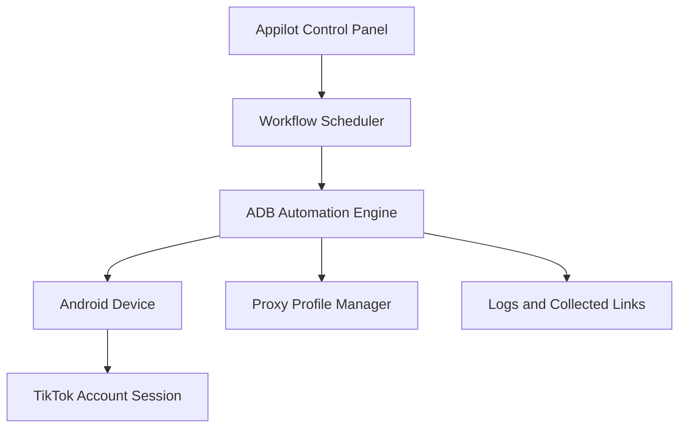
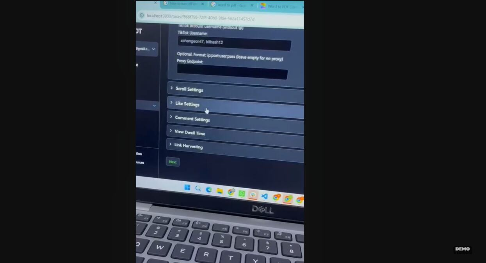
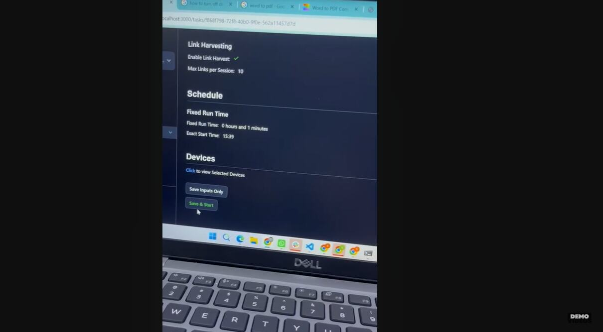
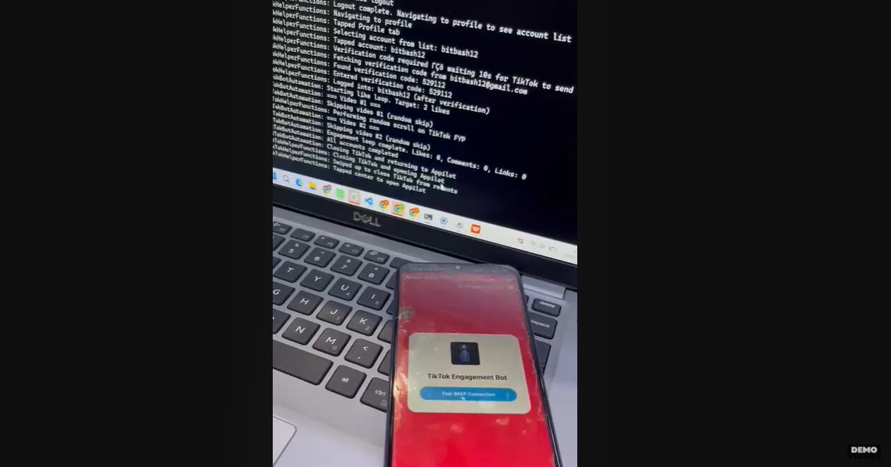
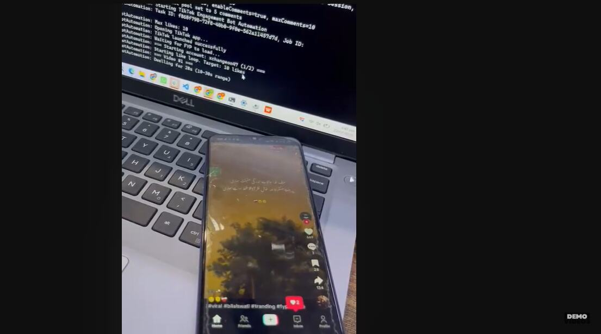
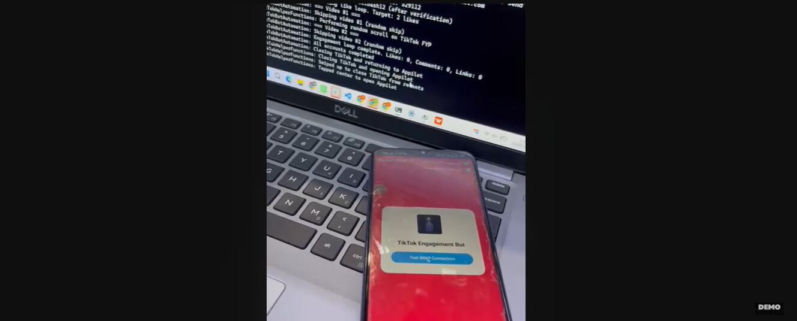
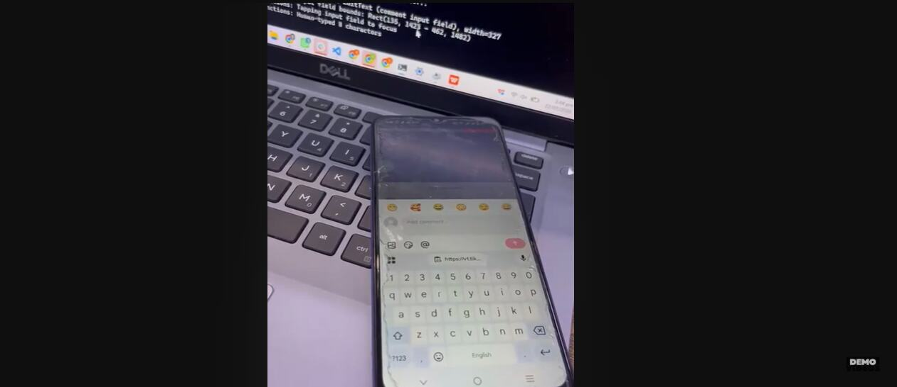

# TikTok Appilot Warmup & Engagement Bot

> ADB-based TikTok mobile automation engine for controlled multi-account workflows on real Android devices.

## Overview

This project delivers a modular Android automation engine that coordinates authorized TikTok account warmup, engagement, proxy configuration, and post-link collection through ADB and device-level UI interaction.

The engine runs accounts sequentially on connected Android devices, exposes configurable action profiles, records execution results, and supports recovery from common device or UI failures.

## Project goals

- Automate approved TikTok warmup and engagement workflows on physical Android devices.
- Coordinate multiple accounts per device through isolated, scheduled sessions.
- Rotate configured network profiles between account sessions.
- Collect post URLs for reporting and downstream workflows.
- Deliver a tested, deployable codebase with clear operational documentation.

## Core capabilities

- **ADB device control:** Launch apps and perform UI actions using Android shell and UI automation primitives.
- **Configurable engagement:** Schedule scrolling, views, likes, comments, and copy-link actions within operator-defined limits.
- **Multi-account orchestration:** Run sequential account sessions with explicit state and error handling.
- **Network profile management:** Apply approved proxy profiles between configured sessions.
- **Link harvesting:** Extract and store post URLs for reporting or downstream processing.
- **Fault tolerance:** Detect stalled screens, retry recoverable actions, and log failures for operator review.

## Architecture

## Product screenshots

### Workflow settings

### Schedule and device assignment

### ADB device connection

### Automated TikTok session

### Account switching

### Comment input workflow

## Workflow

1. Select a connected Android device and approved TikTok account.
2. Apply the configured network profile and session limits.
3. Launch TikTok and execute the selected action sequence.
4. Record completed actions, errors, and collected post links.
5. Close the session cleanly before moving to the next account.

## Demo

Watch the [TikTok Appilot warmup and engagement bot demo](https://youtu.be/n1X45I_F1gU).

## Appilot

Built with the real-device automation capabilities of [Appilot](https://www.appilot.app/).

## Responsible use

Use this project only on accounts and devices you are authorized to manage. Configure all workflows to comply with applicable laws and TikTok's terms, rate limits, and community policies.

## Topics

`tiktok-promote-tool` · `tiktok-automation` · `android-automation` · `adb` · `uiautomator` · `device-automation` · `proxy-rotation` · `appilot`
